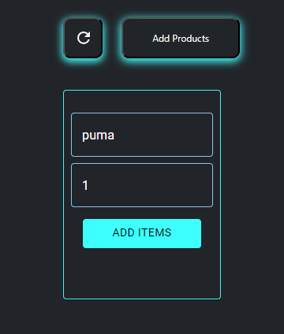
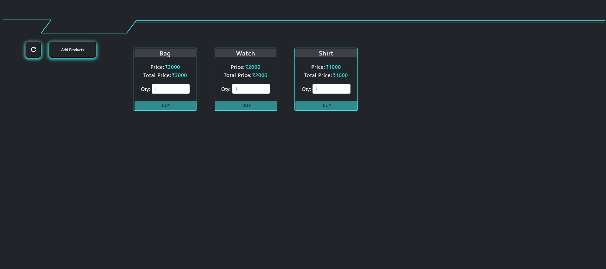
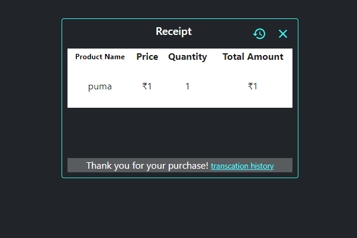
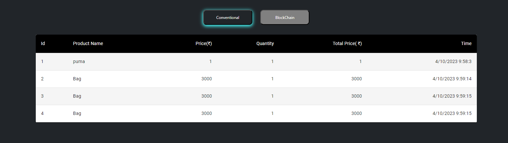

### Procedure

<h2>Experiment to Test the properties of Blockchain and understand how it is different from conventional databases.</h2>

<h3>Inorder to show the difference between conventional database and blockchain database we have developed a use case centered around product purchases where  users input their purchase details, and upon completing the transaction, they receive a receipt Subsequently, users can view their transaction history in both conventional and blockchain databases,thus the user will be able to understand the difference and properties of both conventional and blockchain databases   </h3>

<!-- <h3>Will take a real world scenario to illustrate the difference between conventional databases and blockchain databases for that will simulate a online purchase transaction where an item can be selected and purchased.the user will be able to add new item by providing the product name and price. upon adding the item the product will be listed with buy option  a successfull transaction ends with generating a reciept which will be added to the transaction log. the user will have choice to opt between conventional database and blockchain database thus allowing the user to understand the difference between conventional and blockchain database   -->

  <h4> Click the add button to create a new item by providing the product name and price </h4>
  

 

 <h4>   Click the buy button where the user can select product and  proceed to purchase products </h4>

 

   
  <h4>Successfull transaction end with generating a reciept  </h4>

 

  <h4> Click  the transaction history link provided with reciept  which will show two options to </h4> view data 

 

 <h4> Clicking on conventional database will allow the user to view a table populated with data . </h4>

 

 <h4>Clicking on blockchain database will allow the user to view how data is stored in blockchain database  </h4>

 

