This simulation demonstrates differentiating properties of blockchain such as **Immutability**, **Decentralization**, and **Performance**.

#### Immutability
- This page demonstrates the immutability of blockchain. Add products and click the **BUY** button to purchase them.  
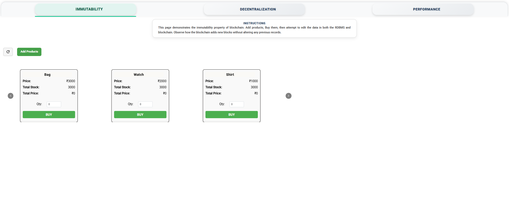

- Click the **EDIT TABLE** button to modify the data in the RDBMS Representation Table.  
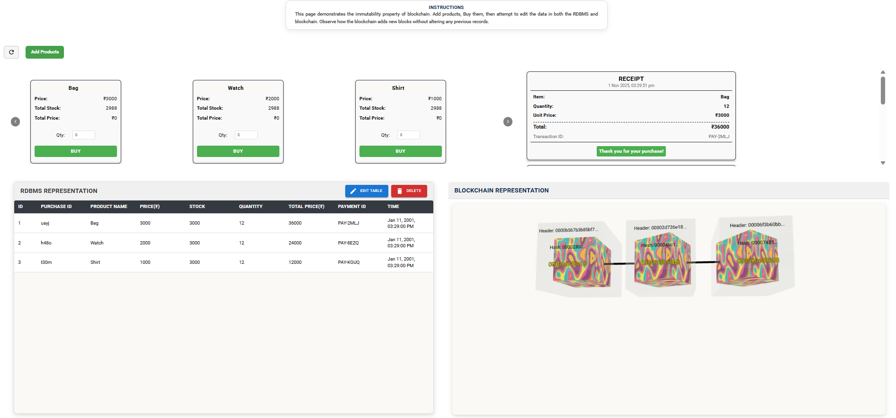
- Once you have successfully edited the data in the RDBMS Representation Table, observe how the Blockchain Representation reflects these updates immutably, ensuring that any modification creates a new linked block rather than altering existing data.
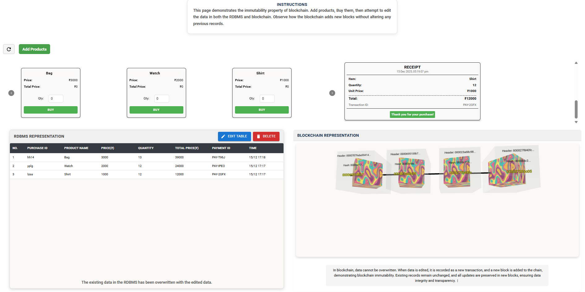

<!-- - Observe how the blockchain reflects these updates immutably, ensuring that any modification creates a new linked block.  
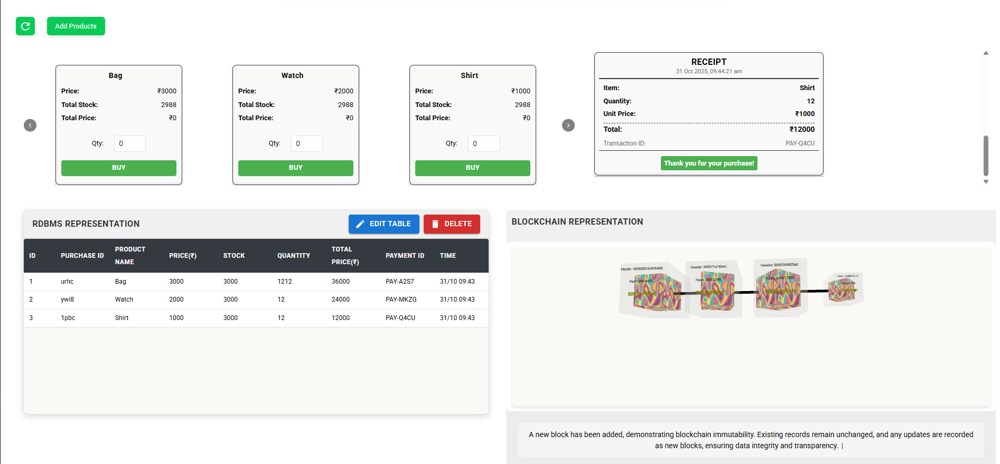 -->

#### Decentralization
- This page demonstrates the concept of decentralization in blockchain.
 To demonstrate data availability, create a transaction by clicking the **BUY** button.
 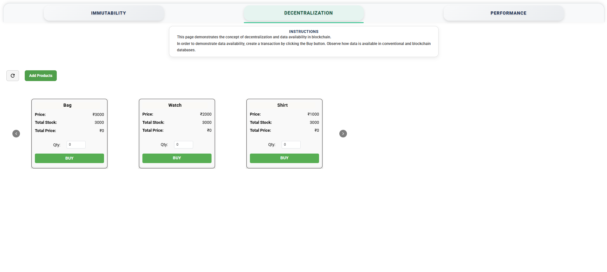

- Observe how data is managed in the conventional and blockchain databases.  
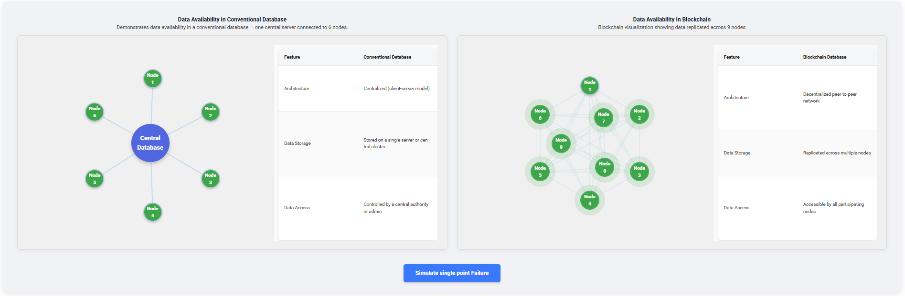
- Click **Simulate Single Point Failure** to observe how a failure impacts the **conventional** and **blockchain** databases.
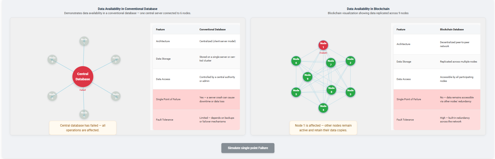
- When the server fails, try to buy a new item. A message will appear stating: “The server is currently down. Choose an option to proceed.” You will be given two options: **Fix and Continue** or **Continue Without Fix**.
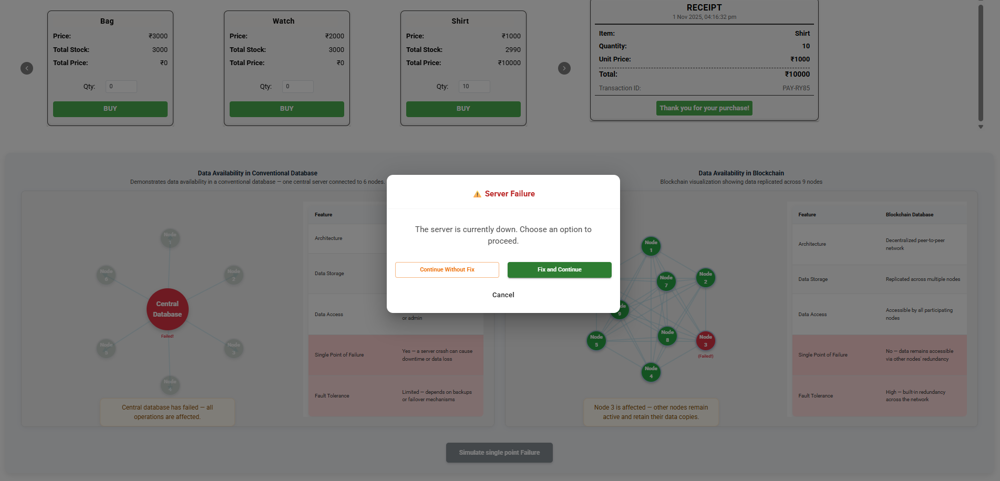
 **Fix and Continue** – Repairs the failed server and restores normal operation.
 **Continue Without Fix** – Proceeds while the server remains down.
In this case:

  - In the **Conventional Database**, new transactions cannot be processed because the central server has failed.
  - In the **Blockchain Database**, even if one node fails, other nodes remain active.
  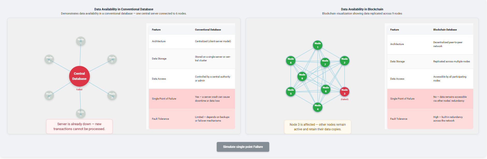

#### Performance
- This page simulates multiple transactions to demonstrate and compare the performance of RDBMS and blockchain systems.

- Select the required products (or use Select All) and click “Buy Selected Products” to observe how each system processes transactions and updates the data.
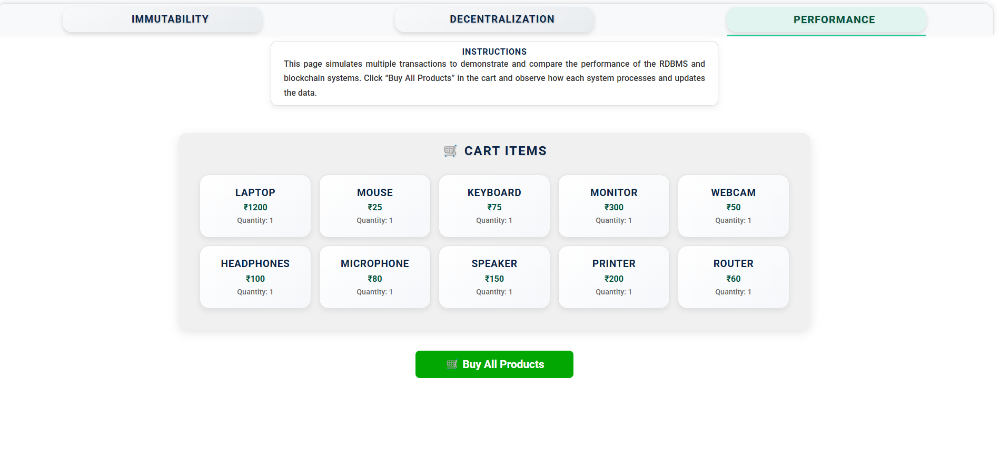
- Observe the RDBMS Representation to see how transactions are updated instantly in a centralized table.
- Observe the Blockchain Representation, where each transaction is processed sequentially and recorded as a new linked block, with the total time reflecting the sum of individual block creation times.  
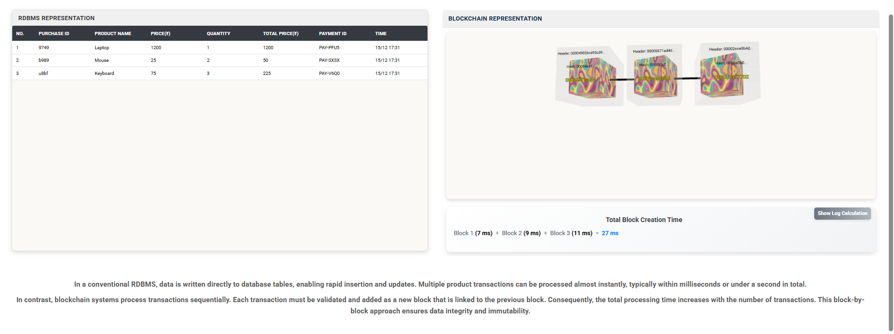
