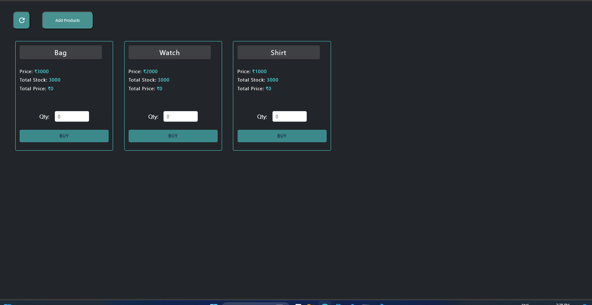
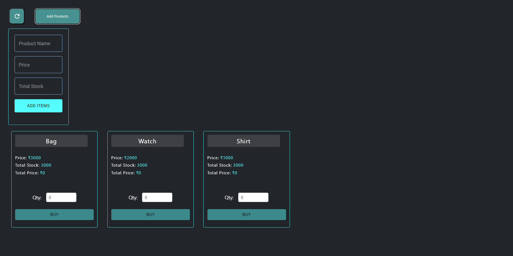
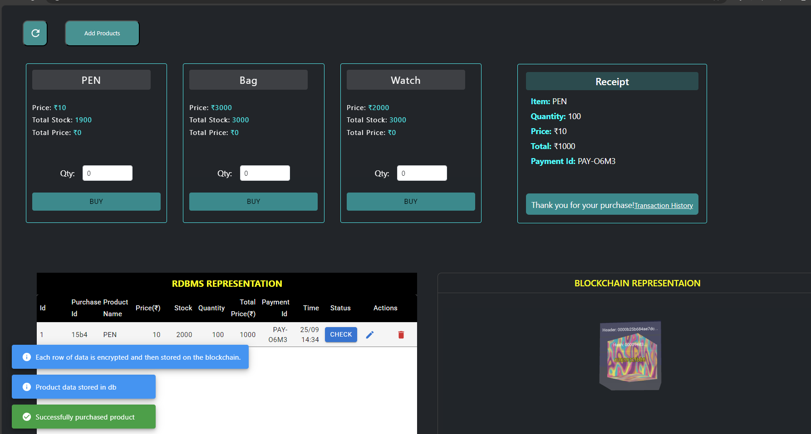
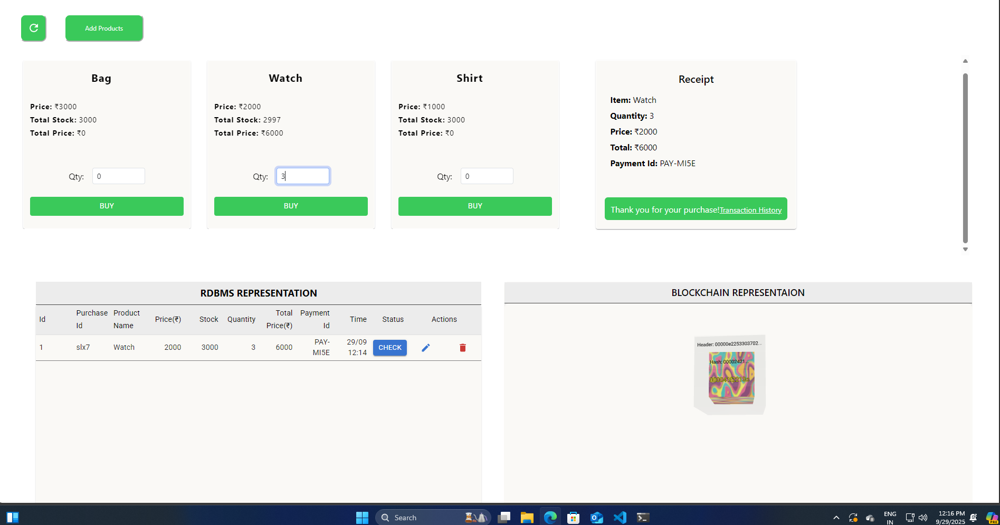
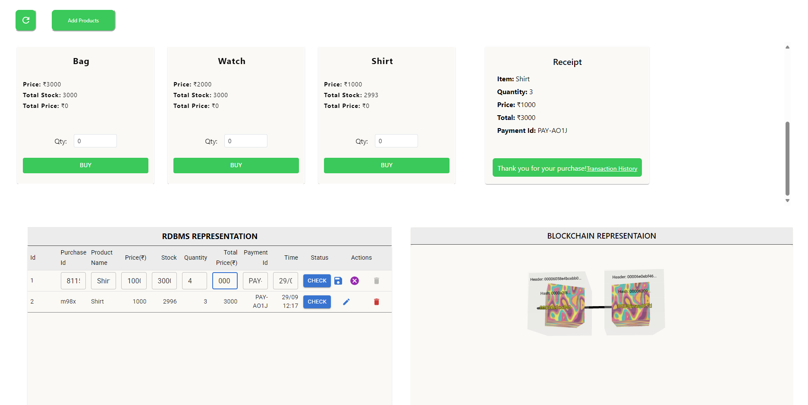
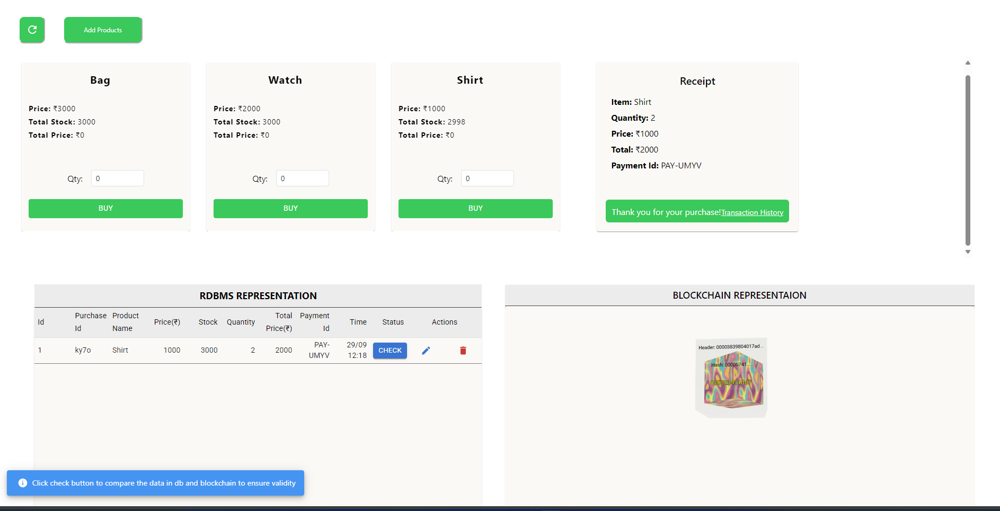
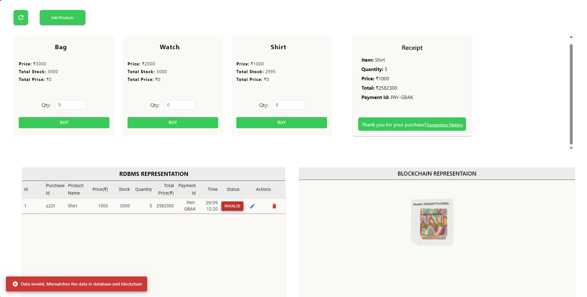

In this demonstration, we simulate product purchases using a database and blockchain. Users first add products by entering the product name, price, and available stock. Then, they select and purchase products, after which a transaction receipt is generated. The purchased data is stored in the database, and an encrypted copy is recorded on the blockchain. Users can edit the database data to observe that it can be altered, while the blockchain data remains secure. Finally, the integrity of the database data can be checked by comparing it with the encrypted blockchain data, showing whether the data is valid or has been tampered with.

   <!-- 
Click the add products to create a new item by providing the product name, price, and available stock 

  

 

  
Click the buy button where the user can select product and  proceed to purchase products 

 

   
  
Succeesfully purchased product and addedd data in database.And the encrypted form of data stored in db store in blockchain

 

  
You can edit the data stored in database, showing that data stored in database can alter rather than data added in blockchain

 

 
  
After edit, save the edited data in database

 

 
  
Now click the check button to esnure Integrity of data in database by comaparing the encrypted data with database data

 

 
  
After if the data valid, shows data is  valid  othervise data is invalid and data in  database alttered

 

  -->

Click the "Add Products" button to create a new item by providing the product name, price, and available stock.

 

Click the "Buy" button to select a product and proceed with the purchase.

 

Successfully purchased products are added to the database, and an encrypted copy of the data is stored on the blockchain.

 

You can edit the data stored in the database, showing that database data can be altered, while data stored on the blockchain remains immutable.

 

After editing, save the updated data in the database.

 

Click the "Check" button to ensure the integrity of the database by comparing it with the encrypted data on the blockchain.

 

If the data is valid, a confirmation will be shown. Otherwise, it indicates that the database data has been altered.

 

