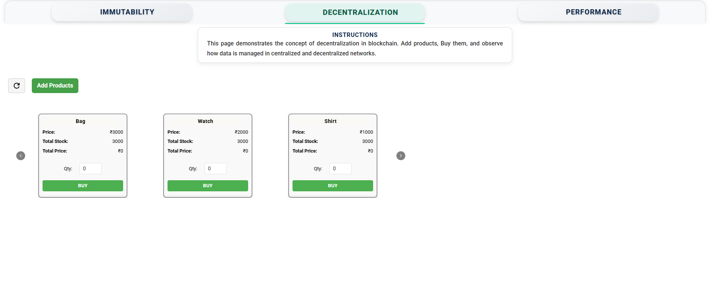

This simulation demonstrates differentiating properties of blockchain such as **Immutability**, **Decentralization**, and **Performance**.

##### Immutability

- This page demonstrates the immutability of blockchain. Add products and click the **“Buy”** button to purchase them.  

- Click the **“Edit”** button to try modifying the data in both the RDBMS and blockchain.  

- Observe how new blocks are added without modifying previous records.  

##### Decentralization

- This page demonstrates the concept of decentralization in blockchain. Add products and click the **“Buy”** button to purchase them.  

- Observe how data is managed in centralized and decentralized networks.  

##### Performance

- This page simulates multiple transactions to demonstrate and compare the performance of the RDBMS and blockchain systems. Click **“Buy All Products”** in the cart and observe how each system processes and updates the data.  
  

