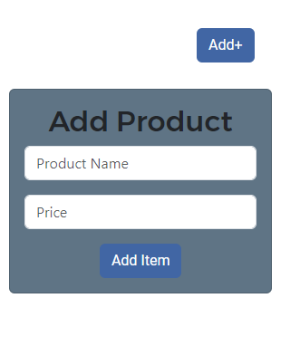
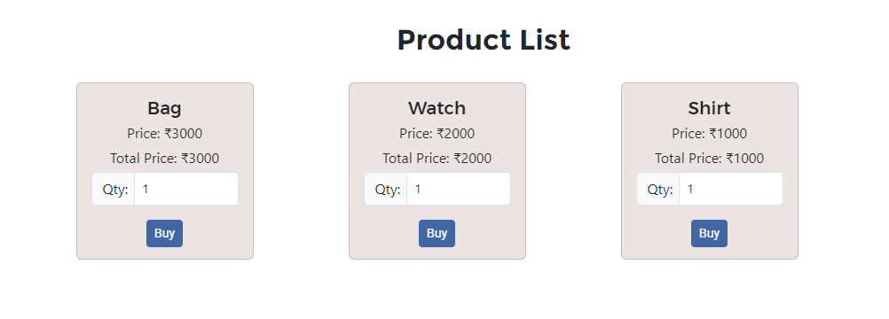
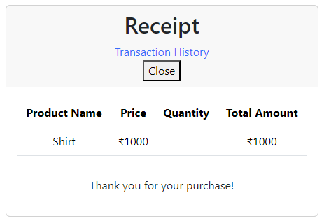
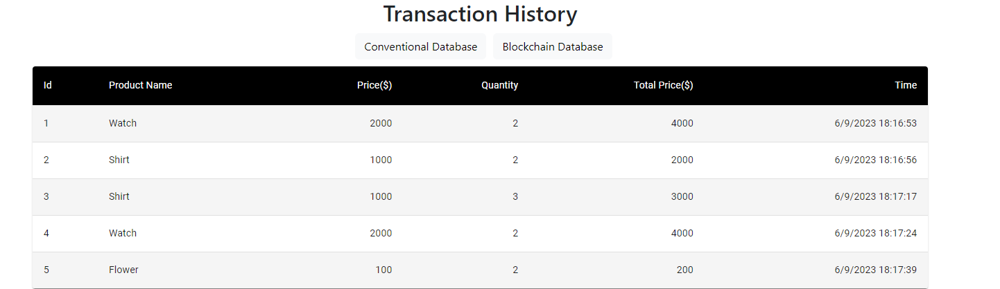

### Experiment to Test the properties of Blockchain and understand how it is different from conventional databases. 

Inorder to show the difference between conventional database and blockchain database we have developed a use case centered around product purchases where  users input their purchase details, and upon completing the transaction, they receive a receipt Subsequently, users can view their transaction history in both conventional and blockchain databases,thus the user will be able to understand the difference and properties of both conventional and blockchain databases   </h6>

<!--  -->

<!-- <h3>Let's take a real world scenario to illustrate the difference between conventional databases and blockchain databases for that will simulate a online purchase transaction where an item can be selected and purchased.the user will be able to add new item by providing the product name and price. upon adding the item the product will be listed with buy option  a successfull transaction ends with generating a reciept which will be added to the transaction log. the user will have choice to opt between conventional database and blockchain database thus allowing the user to understand the difference between conventional and blockchain database   -->

  1. click the add button to create a new item by providing the product name and price 
  

    

  2. click the buy button where the user can select product and proceed to purchase products 
  <!-- product list ui -->
  

  3. A successful transaction ends with generating a receipt

<!-- recipt ui -->

    

4. click on the transaction history link provided with receipt which will show two options to view data 
<!-- ui transaction ui -->

5. clicking on conventional database will allow the user to view a table populated with data .
<!-- <ui table> -->

<!-- <h3>Inorder to show the difference between conventional database and blockchain database we have developed a use case centered around product purchases where  users input their purchase details, and upon completing the transaction, they receive a receipt Subsequently, users can view their transaction history in both conventional and blockchain databases,thus the user will be able to understand the difference and properties of both conventional and blockchain databases   </h3> -->
<!-- <ol>

<li>Click the add button to create  a new product by providing the required details </li>
  <li>Press Add Item to proceed, Products will be listed with buy option </li>
 <li>Enter the required quantity to purchase and press the buy button to generate the reciept</li>
 <li> The receipt will contain a link that leads to your transaction history. Please click on the link to proceed further. </li>
 <li> Once you  choice between conventional and blockchain databases, if you opt for the conventional database, you will see a table populated with data.  </li>
 
 </ol>
 -->